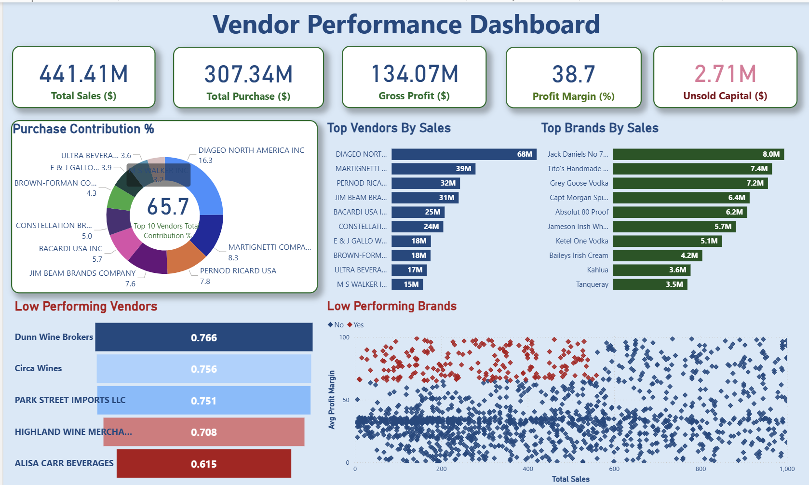
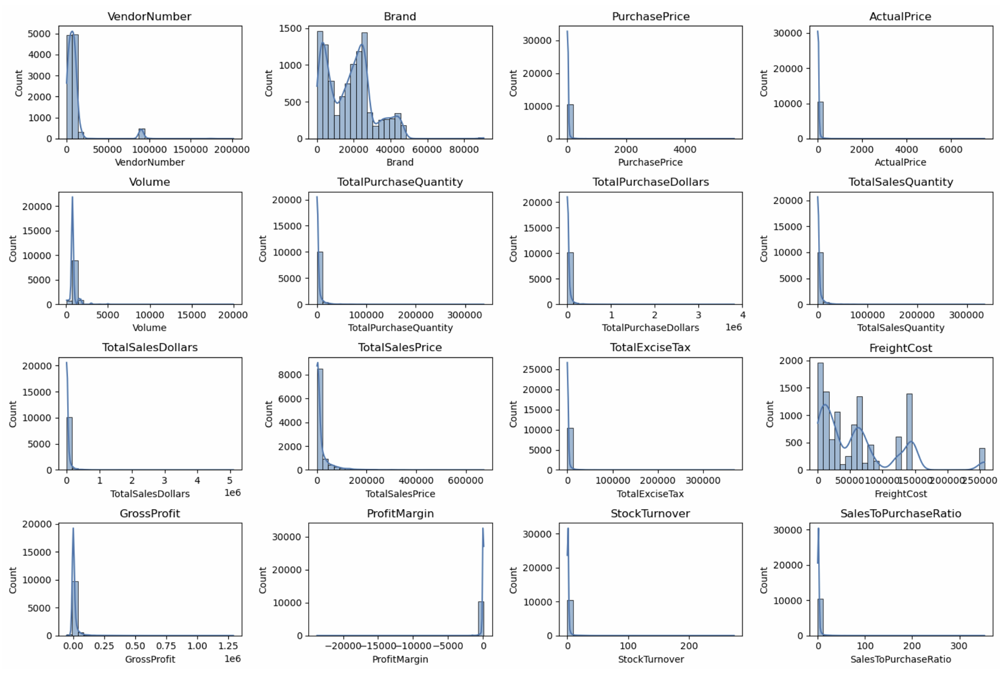
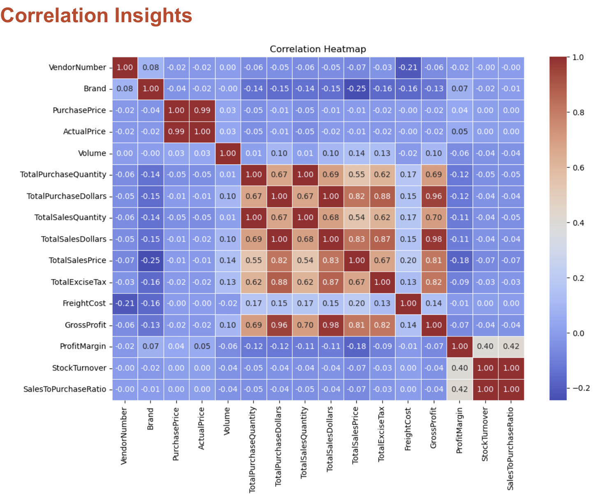
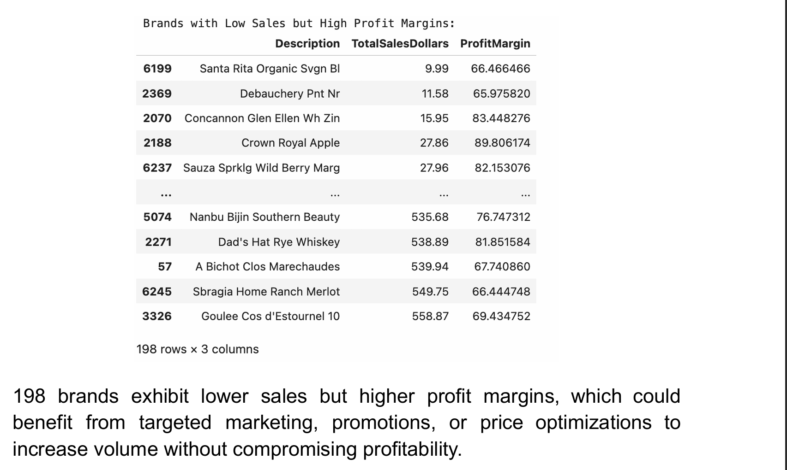
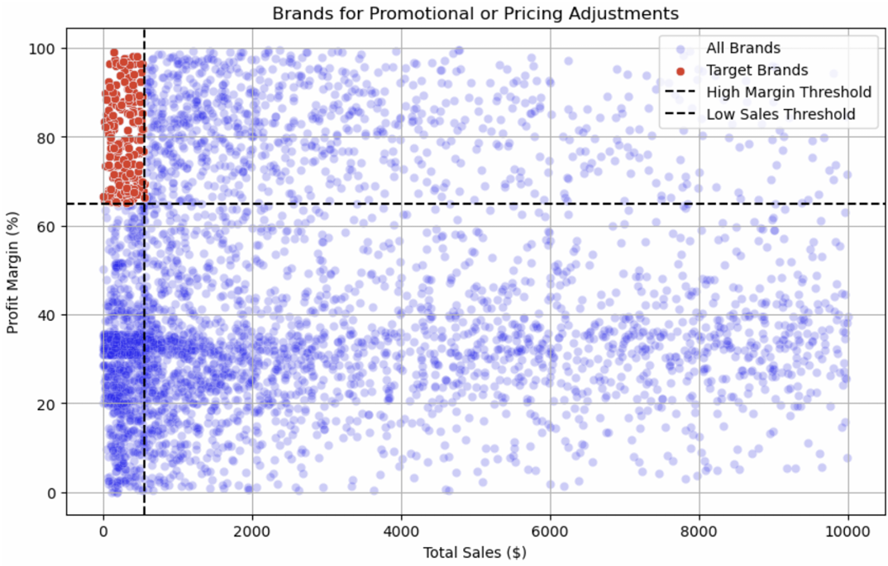
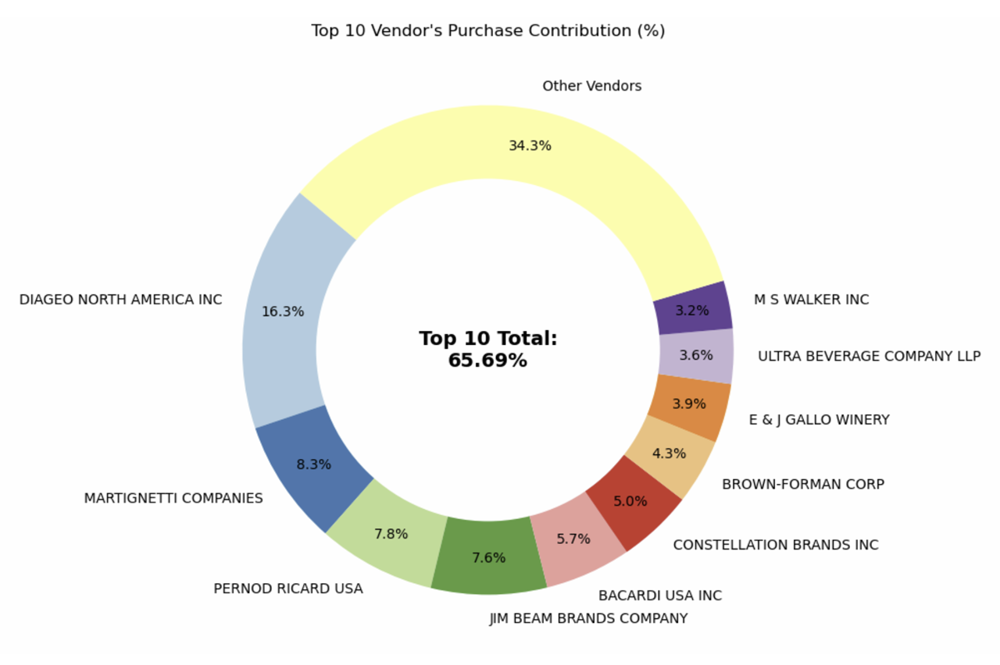
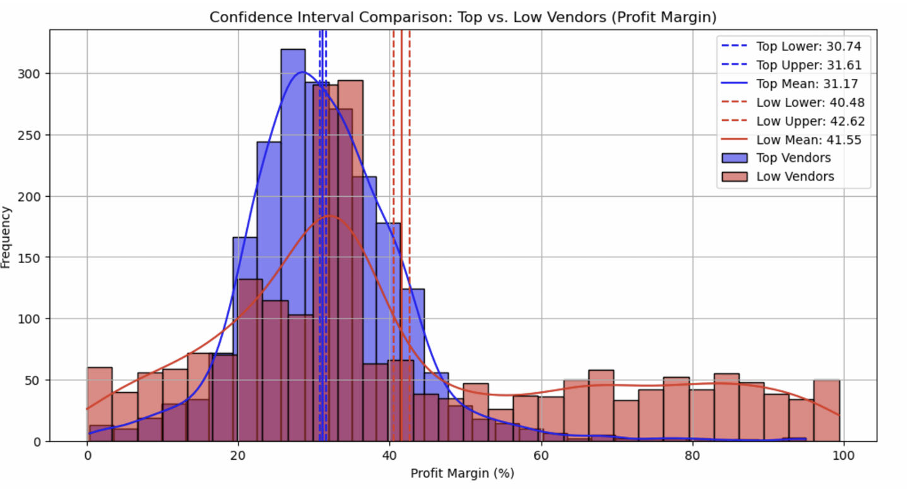

# Vendor Performance Analysis

A vendor and inventory analysis project built from approximately **1.5 GB of raw data** across four source tables.

The project uses **Python, SQLite, SQL and Power BI** to look at vendor concentration, purchasing costs, inventory movement, profit margins and products that may need promotional attention.

**Dataset:** ~1.5 GB across 4 source tables · 119 vendors · $441M total sales · $307M total purchases  
**Stack:** Python · SQLite · SQLAlchemy · pandas · matplotlib · seaborn · scipy · Power BI



### Portfolio Snapshot

- **$441M** in total sales
- **119 vendors**
- Top 10 vendors account for **65.7% of procurement spend**
- Approximately **$2.71M** tied up in unsold inventory
- Lower-volume vendors show margins roughly **10 percentage points higher** than the highest-volume group

---

## Business Problem

The aim of this project was to understand where vendor and inventory performance could be improved.

I focused on five questions:

1. Which brands have strong margins but low sales?
2. How concentrated is procurement spend across vendors?
3. Are larger purchase quantities associated with lower unit costs?
4. Which vendors have slow-moving inventory, and how much money is tied up in unsold stock?
5. Is there a meaningful difference in profit margins between high-sales and low-sales vendors?

---

## Data Pipeline

### Step 1 — Data Ingestion (`01_data_ingestion.py`)

The first script reads the CSV files from the `/data` folder and loads them into a SQLite database called `inventory.db`.

Each source file becomes its own database table.

The script also records basic ingestion activity and runtime.

### Source Tables

| Table | Description |
|---|---|
| `purchases` | Purchase transactions including vendor, brand, quantity and cost |
| `purchase_prices` | Product-level purchase prices by vendor and brand |
| `vendor_invoice` | Purchase-order information including freight costs |
| `sales` | Sales transactions including brand, quantity, revenue and excise tax |

---

### Step 2 — Feature Engineering (`02_get_vendor_summary.py`)

The second script combines the four source tables using a SQL query built around three CTEs:

- `FreightSummary`
- `PurchaseSummary`
- `SalesSummary`

The result is a single `vendor_sales_summary` table used for the main analysis.

The script also:

- converts data types
- fills missing values where required
- removes unnecessary whitespace
- creates additional business metrics

### Metrics Created

| Metric | Formula |
|---|---|
| `GrossProfit` | TotalSalesDollars − TotalPurchaseDollars |
| `ProfitMargin` | (GrossProfit / TotalSalesDollars) × 100 |
| `StockTurnover` | TotalSalesQuantity / TotalPurchaseQuantity |
| `SalesToPurchaseRatio` | TotalSalesDollars / TotalPurchaseDollars |

The final summary is saved to both:

- `inventory.db`
- `vendor_sales_summary.csv`

---

### Step 3 — Analysis & Visualisation (`03_vendor_analysis.py`)

The third script loads the cleaned vendor summary and performs the main analysis.

The raw summary contained **10,692 records**.

For parts of the profitability analysis, records with zero or negative profit and zero sales were excluded so that margin comparisons were not distorted by invalid or non-comparable values.

---

## Exploratory Data Analysis

### Distribution Analysis

The numerical variables are strongly right-skewed, which means most observations sit toward the lower end while a smaller number of vendors or products account for much larger values.



### Main Observations

- **Gross Profit** reaches a minimum of **−$52,002.78**, showing that some products generated losses.
- Some records have zero sales while still carrying purchase cost, creating invalid or extreme margin values.
- **Freight Cost** ranges from **$0.09 to $257,032**, showing a very wide spread in shipping costs.
- **Stock Turnover** ranges from 0 to 274.5, meaning inventory movement varies substantially across products and vendors.

These checks were useful for deciding which records should be included in the later profitability analysis.

---

## Correlation Analysis



| Relationship | Correlation | Interpretation |
|---|---:|---|
| Purchase Qty ↔ Sales Qty | **0.999** | Purchase and sales quantities move very closely together in the aggregated data |
| Purchase Price ↔ Gross Profit | −0.016 | Very little linear relationship |
| Profit Margin ↔ Total Sales Price | −0.179 | Weak negative relationship |
| Stock Turnover ↔ Gross Profit | −0.038 | Very little linear relationship |

The strongest result is the **0.999 correlation between purchase and sales quantities**.

This shows that the two measures move extremely closely together in the aggregated dataset.

It may indicate that purchasing volumes were generally aligned with realised sales, although correlation alone is not enough to prove that the business had an effective forecasting process.

The other relationships are much weaker, suggesting that profit performance cannot be explained by any one of these variables alone.

---

# Research Questions & Findings

## 1. Which Brands May Need Promotional Attention?

I looked for brands that were:

- in the **bottom 15% of sales**
- but in the **top 15% of profit margin**

This identified **198 brands**.





The highlighted brands sit in the high-margin / low-sales area of the chart.

They already produce relatively strong margins, but sales volume is low.

Rather than immediately reducing prices, these products could be investigated for:

- targeted promotions
- bundle offers
- better product placement
- wider distribution
- marketing support

The important point is that these products have reasonable margin potential but are currently selling in relatively low volumes.

---

## 2. How Concentrated Is Procurement Spend?

The top 10 vendors account for **65.69% of total procurement spend**.

Diageo North America alone represents approximately **16.3%**.



| Rank | Vendor | Contribution |
|---|---|---:|
| 1 | Diageo North America Inc | 16.3% |
| 2 | Martignetti Companies | 8.3% |
| 3 | Pernod Ricard USA | 7.8% |
| 4 | Jim Beam Brands Company | 7.6% |
| 5 | Bacardi USA Inc | 5.7% |

The top three vendors together represent more than **32% of procurement spend**.

That concentration does not automatically mean there is a problem, but it does show that a relatively small number of suppliers account for a large share of purchasing.

From a procurement perspective, those relationships would be worth monitoring for:

- supplier dependency
- pricing negotiations
- availability risk
- alternative suppliers

---

## 3. How Does Purchase Size Relate to Unit Cost?

Purchase orders were divided into three groups based on quantity.

| Order Size | Avg Unit Price |
|---|---:|
| Small | $39.06 |
| Medium | $15.49 |
| Large | $10.78 |

Large-volume purchases had an average unit price approximately **72% lower** than small-volume purchases in this dataset.

The largest difference occurs between the Small and Medium groups.

The difference between Medium and Large orders is smaller, suggesting that the benefit from increasing purchase quantity becomes less dramatic at higher volumes.

This does not prove that increasing order size directly causes lower prices, because vendor mix and product mix may also affect unit cost.

However, the pattern suggests that purchase quantity should be considered when reviewing procurement costs.

---

## 4. Slow-Moving Inventory & Unsold Stock

The analysis identified approximately **$2.71M** tied up in unsold inventory.

| Lowest Turnover Vendors | Turnover | Highest Unsold Inventory Value | Value |
|---|---:|---|---:|
| Alisa Carr Beverages | 0.615 | Diageo North America Inc | $722.21K |
| Highland Wine Merchants LLC | 0.708 | Jim Beam Brands Company | $554.67K |
| Park Street Imports LLC | 0.751 | Pernod Ricard USA | $470.63K |
| Circa Wines | 0.756 | William Grant & Sons Inc | $401.96K |
| Dunn Wine Brokers | 0.766 | E & J Gallo Winery | $228.28K |

Two different issues appear here.

The vendors with the **largest dollar value of unsold stock** are also some of the largest procurement vendors. Their absolute inventory values are therefore partly explained by their overall scale.

The vendors with the **lowest turnover ratios** are different. These may deserve closer attention because inventory is moving more slowly relative to the amount purchased.

Possible areas for review include:

- purchase quantities
- product demand
- SKU mix
- reorder levels
- promotional activity

---

## 5. Do High-Sales and Low-Sales Vendors Have Different Margins?



| Group | 95% CI | Mean Margin |
|---|---|---:|
| Top vendors (≥ 75th percentile sales) | 30.74% – 31.61% | **31.17%** |
| Low vendors (≤ 25th percentile sales) | 40.48% – 42.62% | **41.55%** |

A Welch's t-test was used to compare the two groups.

**Result:** `p < 0.05`

The difference in average margins between the groups is statistically significant within this dataset.

Low-sales vendors have an average margin of approximately **41.55%**, compared with **31.17%** for the highest-sales vendors.

That is a difference of roughly **10 percentage points**.

One possible explanation is that high-volume vendors operate with lower margins while some lower-volume products are sold at higher margins.

The data does not prove why the difference exists, but it does identify a group of lower-volume vendors that may be worth investigating for growth opportunities.

---

## Key Findings Summary

1. **Top 10 vendors account for 65.7% of procurement spend**  
   Procurement is concentrated among a relatively small number of suppliers.

2. **Larger purchases are associated with lower average unit prices**  
   Large orders averaged **$10.78 per unit**, compared with **$39.06** for small orders.

3. **Low-sales vendors have higher average margins**  
   The low-sales group averaged approximately **41.55% margin**, compared with **31.17%** for the high-sales group.

4. **Approximately $2.71M is tied up in unsold inventory**  
   Both absolute inventory value and turnover rate need to be considered when deciding which vendors require attention.

5. **Purchase and sales quantities are very closely related**  
   The correlation was **0.999**, although this should not be interpreted as proof of forecasting quality.

6. **198 brands combine high margins with low sales**  
   These brands may be worth testing with targeted promotion or wider distribution.

---

## Main Business Takeaway

The biggest lesson from the project is that vendor performance cannot be judged from sales alone.

A high-sales vendor may:

- generate large revenue
- operate on relatively thin margins
- account for a large share of procurement
- and hold a large amount of unsold inventory

At the same time, some smaller vendors have much stronger margins but limited sales.

The most useful approach is therefore to look at **sales, margin, purchasing concentration and inventory turnover together** before deciding where action is needed.

---

## Project Structure

```text
vendor-performance-analysis/
│
├── data/                            # Raw CSV files (not included — ~1.5 GB)
├── logs/                            # Ingestion and processing logs
│
├── 01_data_ingestion.py            # Loads CSVs into SQLite
├── 02_get_vendor_summary.py        # CTE joins, cleaning and feature engineering
├── 03_vendor_analysis.py           # Analysis, statistics and charts
│
├── outputs/
│   ├── 00_dashboard.png
│   ├── 01_distributions.png
│   ├── 02_correlation_heatmap.png
│   ├── 03_promotional_brands.png
│   ├── 04_promotional_brands_scatter.png
│   ├── 05_donut_vendor_scatter.png
│   └── 06_confidence_intervals.png
│
├── vendor_sales_summary.csv
├── vendor_performance.pbix
├── Vendor_Performance_Report.pdf
└── README.md
```

---

## Tech Stack

| Tool | Purpose |
|---|---|
| Python 3.12 | Data processing and analysis |
| pandas | Data cleaning, manipulation and aggregation |
| SQLite + SQLAlchemy | Database storage and SQL querying |
| matplotlib + seaborn | Data visualisation |
| scipy.stats | Welch's t-test and confidence intervals |
| Power BI | Interactive dashboard |

---

## Setup & Usage

> **Note:** The raw dataset (~1.5 GB) is not included in the repository because of its size.

```bash
# Clone the repository
git clone https://github.com/shababtahsin/vendor-performance-analysis-Portfolio-4.git

cd vendor-performance-analysis-Portfolio-4

# Install dependencies
pip install pandas sqlalchemy scipy matplotlib seaborn numpy

# Run the pipeline
python 01_data_ingestion.py
python 02_get_vendor_summary.py
python 03_vendor_analysis.py
```

Open `vendor_performance.pbix` in Power BI Desktop to view the interactive dashboard.

---

## Author

**Shah Tahsin**  
Business Data Analyst | SQL · Python · Power BI

[GitHub](https://github.com/shababtahsin)
````
